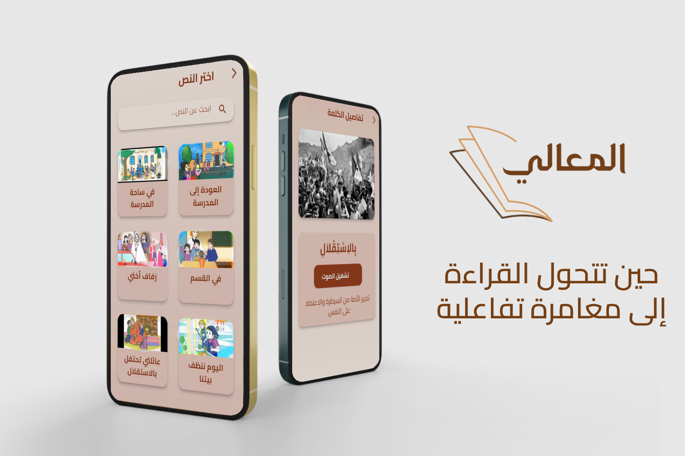

# Al Maali

> 📚 Educational Flutter app for Arabic learning with interactive texts, audio support, and responsive design.

Al Maali is an educational Flutter application designed to help children learn Arabic through interactive texts, highlighted words, and audio support. The app features a beautiful, responsive UI and supports multiple levels and texts, making it suitable for various age groups and learning stages.

## Features

- 📚 **Multiple Levels:** Organized content by educational level for progressive learning.
- 📝 **Interactive Texts:** Each text includes highlighted words for focused learning.
- 🔊 **Audio Support:** Listen to the pronunciation of words to improve reading and listening skills.
- 🖼️ **Rich Media:** Includes images and audio for an engaging learning experience.
- 📱 **Responsive Design:** Adapts to all screen sizes (phones and tablets).
- 🔒 **User Authentication:** Register and log in to save your progress.
- 🌙 **Modern UI:** Clean, attractive, and easy-to-use interface.

## Screenshots

> 

## Getting Started

### Prerequisites
- [Flutter SDK](https://flutter.dev/docs/get-started/install)
- Dart SDK (usually included with Flutter)
- A device or emulator (Android/iOS/Web)

### Installation
1. **Clone the repository:**
   ```bash
   git clone https://github.com/your-username/al_maali.git
   cd al_maali
   ```
2. **Install dependencies:**
   ```bash
   flutter pub get
   ```
3. **Run the app:**
   ```bash
   flutter run
   ```

> _If you want to run on a specific platform (web, android, ios), use:_
> ```bash
> flutter run -d chrome   # for web
> flutter run -d android  # for Android
> flutter run -d ios      # for iOS
> ```

## Project Structure

- `lib/` — Main application code (UI, controllers, models, utilities)
- `assets/` — Images, audio, and fonts used in the app
- `android/`, `ios/`, `web/` — Platform-specific files

## Customization
- You can add or modify texts, images, and audio files in the `assets/` directory.
- Update `pubspec.yaml` to include any new assets or fonts.

## Contributing
Pull requests are welcome! For major changes, please open an issue first to discuss what you would like to change.

## License
This project is licensed under the MIT License. See the [LICENSE](LICENSE) file for details.

